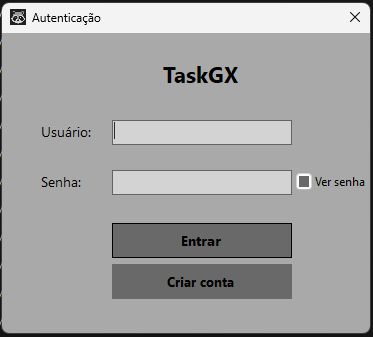
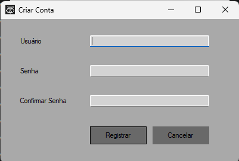
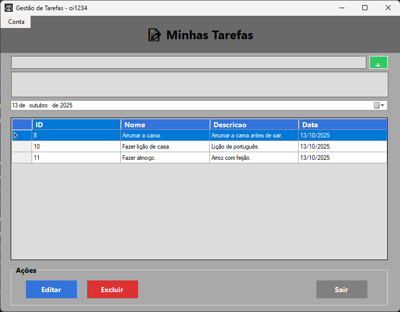
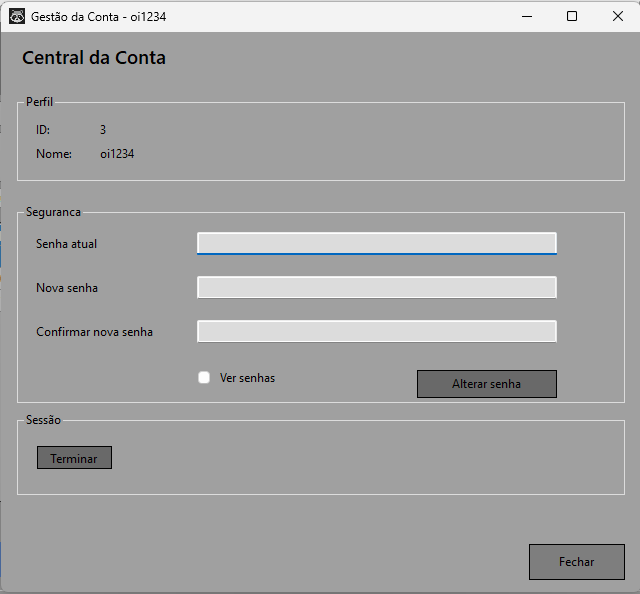

# 🧩 TaskGX — Sistema de Gestão de Tarefas (C# + MySQL)


Sistema de **gestão de tarefas multiusuário**, desenvolvido em **C# (Windows Forms)** com **MySQL**, autenticação segura com **SHA2(256 bits)** e interface intuitiva.

---

## 🚀 Funcionalidades

✅ **Autenticação Segura** — Login com hash SHA2(256)  
✅ **Criação de Conta** — Registo de novos usuários  
✅ **Gestão de Tarefas Individual**  
- Adicionar, editar e excluir tarefas  
- Cada usuário vê apenas suas próprias tarefas  

✅ **Gestão de Conta**  
- Alterar senha com verificação da senha atual  
- Terminar sessão e retornar à tela de login  

✅ **Interface Windows Forms**  
- Formulários centralizados  
- Navegação fluida entre telas  

---

## 🖼️ Capturas de Tela

### Tela de Login


### Criar Nova Conta


### Gestão de Tarefas


### Central da Conta


---

## 🗂️ Estrutura do Projeto

TaskGX/
├── GUI/
│   ├── FormTarefas.cs
│   ├── FormCentralConta.cs
│   ├── FormCriarConta.cs
│   └── FormTarefas.Designer.cs
├── Form1.cs                        # Tela de login
├── LigacaoDB.cs                    # String de conexão MySQL
├── Program.cs                      # Ponto de entrada
├── TaskGX_DB.sql                   # Script SQL da base de dados
└── README.md
```

---

## ⚙️ Requisitos

- **.NET Framework 4.7.2** ou superior  
- **Visual Studio 2019/2022**  
- **MySQL Server 8.0**  
- Pacotes NuGet:
  - `MySql.Data`
  - `Dapper`

---

## 🛠️ Configuração da Base de Dados

Execute o script SQL `TaskGX_DB.sql` no MySQL Workbench:

```sql
DROP DATABASE IF EXISTS TaskGX_DB;
CREATE DATABASE IF NOT EXISTS TaskGX_DB
    CHARSET utf8mb4
    COLLATE utf8mb4_general_ci;

USE TaskGX_DB;

CREATE TABLE IF NOT EXISTS Utilizadores (
    ID INT AUTO_INCREMENT PRIMARY KEY NOT NULL,
    Nome VARCHAR(100) NOT NULL,
    Senha VARCHAR(255) NOT NULL
);

CREATE TABLE IF NOT EXISTS Tarefa (
    ID INT AUTO_INCREMENT PRIMARY KEY,
    Nome VARCHAR(100) NOT NULL,
    Descricao TEXT,
    `Data` DATE NOT NULL,
    UtilizadorID INT NOT NULL,
    FOREIGN KEY (UtilizadorID) REFERENCES Utilizadores(ID)
);

INSERT INTO Utilizadores (Nome, Senha) VALUES
('Lucas', SHA2('lucas123', 256)),
('Monilo', SHA2('nilo123', 256));

INSERT INTO Tarefa (Nome, Descricao, Data, UtilizadorID) VALUES
('Estudar C#', 'Ler capítulos sobre Dapper e Entity Framework', '2025-10-10', 1),
('Atualizar Projeto', 'Adicionar funcionalidade de login e gestão de tarefas', '2025-10-12', 2),
('Backup da Base', 'Fazer backup completo da base de dados TaskGX_DB', '2025-10-13', 2);
```

---

## 🔗 Ligação MySQL

No arquivo `LigacaoDB.cs`, configure a string de conexão:

```csharp
public static string GetConnectionString()
{
    return "Server=127.0.0.1;Database=TaskGX_DB;Uid=root;Pwd=;Charset=utf8mb4;Port=3306;SslMode=none";
}
```

> Substitua `Pwd=` pela senha do seu usuário MySQL, se houver.

---

## ▶️ Executando o Projeto

1. Abra o projeto no **Visual Studio**  
2. Restaure pacotes NuGet (`MySql.Data` e `Dapper`)  
3. Configure **Form1** como startup form  
4. Pressione **F5** para executar  

---

## 🔑 Usuários de Teste

| Usuário | Senha |
|---------|-------|
| Lucas   | lucas123 |
| Monilo  | nilo123 |

> Cada usuário verá apenas suas próprias tarefas.

---

## 🔐 Segurança

- Senhas **criptografadas** com `SHA2(256)`  
- Confirmação da senha atual antes de alterar  
- Sessões independentes por usuário  
- Sem armazenamento de senhas em texto simples  

---

## 💡 Dicas de Uso

- Botão **“Gerir Conta”** abre a tela de perfil com informações do usuário  
- Botão **“Terminar Sessão”** fecha todas as forms abertas e retorna ao login  
- Ao clicar em uma tarefa no `GridView`, o título, descrição e data são carregados nos campos correspondentes  

---

## 👨‍💻 Desenvolvido por

**Projeto TaskGX** — Aprendizado prático em C#, MySQL e autenticação segura.  
📚 Foco em boas práticas, segurança e arquitetura limpa.

---

## 📜 Licença

🧾 Este projeto é de **uso livre para fins educativos e pessoais**.  
Sinta-se à vontade para estudar, modificar e expandir.

---

> 💬 _“A melhor maneira de prever o futuro é criá-lo.”_ — Peter Drucker

